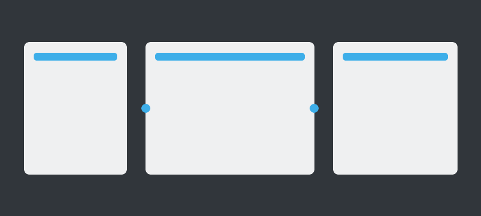
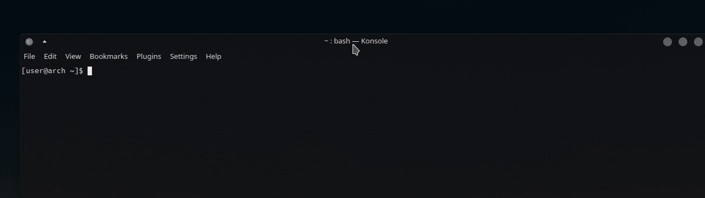
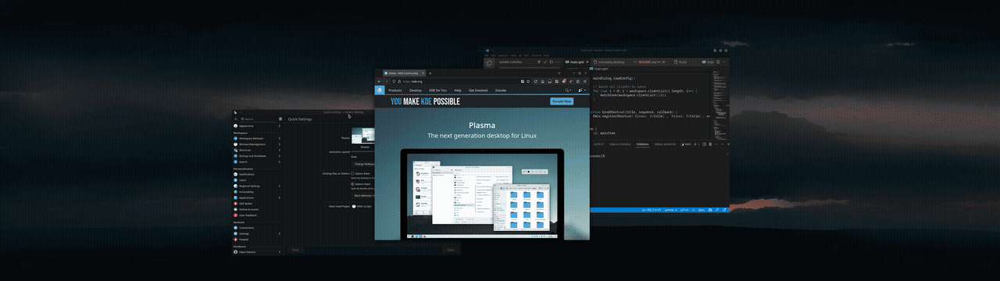
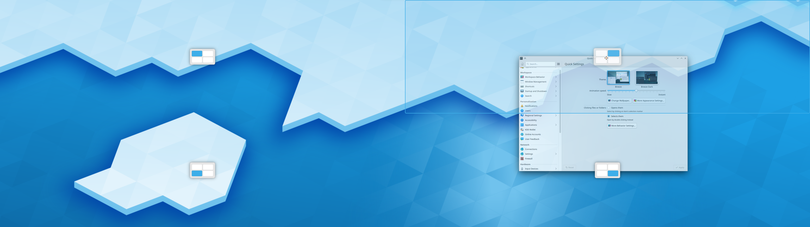

# Magnetile


KDE Plasma 6.4+ KWin script for snapping windows into zones with connected tile resizing.

Magnetile is a GPL-3.0 derivative of KZones. It keeps the core FancyZones-style
zone workflow that made KZones useful, then extends it for a Wayland-only KDE
Plasma 6 setup with connected resizing, stronger multi-monitor behavior, and a
visual layout editor helper.

Development of the Magnetile-specific changes is AI-assisted. Human review,
testing, packaging, and licensing responsibility remain with the Magnetile
contributors.

## Relationship to KZones

Magnetile is not presented as an original clean-room replacement for KZones. It
is derived from [KZones](https://github.com/gerritdevriese/kzones) and keeps
KZones attribution in [NOTICE.md](./NOTICE.md). Because KZones is GPL-3.0,
Magnetile is distributed under GPL-3.0 as well.

The goal is to preserve compatible KZones behavior while making targeted
improvements for modern Plasma 6 Wayland workflows.

### Preserved KZones Features

Magnetile keeps the original KZones-style workflow and feature set, including:

- FancyZones-style custom layouts made from percentage-based zones.
- A top-of-screen zone selector while dragging windows.
- A visual zone overlay while moving windows.
- Optional edge snapping.
- Multiple saved layouts.
- Keyboard shortcuts for moving windows to zones, cycling layouts, switching
  layouts, moving to neighboring zones, cycling windows in a zone, and snapping
  windows.
- Plasma color-scheme aware overlay and selector styling.
- JSON-based layout configuration.

These features come from the KZones base and are preserved so existing KZones
users have a familiar workflow.

### New In Magnetile

Compared with the original KZones base, Magnetile adds:

- Connected resizing: adjacent tiled windows resize after a manual edge resize,
  and later snaps can follow the resized runtime grid.
- KDE Plasma 6 / KWin 6 Wayland focus with no X11-specific code paths.
- Resolution-independent geometry fixes for multi-monitor layouts, including
  outputs that do not start at `x=0, y=0`.
- Per-monitor layout defaults through `monitorLayoutsJson`.
- Independent active-layout tracking per output and optionally per virtual
  desktop.
- Free movement overrides for temporarily dragging a window outside Magnetile's
  snap grid.
- A visual layout editor helper for creating, renaming, duplicating, deleting,
  reordering, previewing, importing, and exporting JSON layouts.
- Editor support for snapping, padding preview, preview aspect ratios, and
  saved JSON layout files.
- Documentation for the current architecture, schema choices, local testing,
  and known KWin scripted-config limitations.

## Features

### Connected Resizing

Connected resizing is Magnetile's headline feature. Resize a snapped window
with the mouse and adjacent snapped windows on the same output, virtual
desktop, activity, and layout resize with it so the tile group stays connected.
Future snaps on that output use the adjusted runtime grid until the script
reloads or the configuration changes.



Recorded on 5120x1440.

### KZones-Inherited Workflow

Magnetile keeps the familiar zone selector, drag overlay, edge snapping,
multiple layouts, shortcuts, and Plasma-aware theming from its KZones base.

### Zone Selector

Drag a window toward the top of the current monitor to reveal a compact layout
picker. Drop onto a zone preview to send the window there without cycling
layouts first.



### Zone Overlay

While moving a window, Magnetile can draw the active layout over the current
monitor. Releasing the window over a highlighted zone snaps it into that zone.



### Edge Snapping

Optional edge snapping lets a window target nearby zones when the pointer is
close to a monitor edge. Disable KDE's built-in edge snap first if the two
behaviors conflict.


### Multiple Layouts

Keep several percentage-based layouts and switch between them with shortcuts,
the selector, or per-monitor defaults.


### Keyboard Shortcuts

Shortcut actions cover moving windows to zones, switching layouts, moving to
neighboring zones, cycling windows in a zone, and snapping all visible windows.


### Free Movement

Press `Ctrl+Alt+F` to toggle free movement for the active window. If you press
it while dragging a window, the current drop will stay at the custom size and
position. Press `Ctrl+Alt+F` again, or use any zone shortcut or snap shortcut,
to put the window back under Magnetile control.

### Multi-Monitor Presets

Each KWin output can seed its own default layout. Runtime layout switching can
be tracked independently per monitor, and optionally per virtual desktop.

### Visual Layout Helper

Use the local browser editor at `tools/layout-editor.html` to design layouts
without writing JSON by hand. The helper previews padding, screen ratios, and
zone snapping, then exports the same JSON schema Magnetile uses at runtime.

### Theming

Overlay and selector colors follow the active Plasma color scheme.



## Requirements

- KDE Plasma 6.4 or newer
- KWin 6 on Wayland
- `kpackagetool6`
- `qdbus6`
- `make`
- `zip`, or Python 3 for the Makefile fallback packager

## Installation

Clone and install locally:

```sh
git clone https://github.com/jcearnal/magnetile.git
cd magnetile
make
kwriteconfig6 --file kwinrc --group Plugins --key magnetileEnabled true
qdbus6 org.kde.KWin /KWin reconfigure
qdbus6 org.kde.KWin /Scripting org.kde.kwin.Scripting.start
```

After installing, open:

`System Settings / Window Management / KWin Scripts`

Enable **Magnetile** if it is not already enabled. Open Magnetile's settings
with the gear button next to the script entry.

When updating an existing install, KWin may keep an older script instance alive.
If changes do not appear after `make`, restart KWin scripting:

```sh
qdbus6 org.kde.KWin /KWin reconfigure
qdbus6 org.kde.KWin /Scripting org.kde.kwin.Scripting.start
```

If that still does not reload the script, restart KWin:

```sh
qdbus6 org.kde.KWin /KWin org.kde.KWin.replace
```

## Configuration

Open the settings from:

`System Settings / Window Management / KWin Scripts / Magnetile / ⚙️`

### General

#### Basic workflow

1. Pick or create a layout in the **Layouts** tab.
2. Move a window into a zone with `Ctrl+Alt+1..9`, the top zone selector, or
   edge snapping if enabled.
3. Switch layouts with `Ctrl+Alt+Shift+1..9` or cycle with `Ctrl+Alt+D`.
4. Resize a snapped window by dragging an edge. Adjacent snapped windows in the
   same layout follow after release.
5. Press `Ctrl+Alt+F` when a window should temporarily ignore Magnetile drag
   snapping.

#### Zone Selector

Controls whether the top-of-screen layout picker appears while dragging a
window, and how close the pointer needs to be before it opens.

#### Zone Overlay

Controls the moving-window overlay, when it appears, how zones are highlighted,
and whether indicators show every zone or only the target zone.

#### Edge Snapping

Controls whether monitor edges can trigger zone targeting and how far from an
edge the pointer can be before snapping begins.

#### Remember and restore window geometries

Stores a window's floating geometry before it enters a zone and restores that
geometry when it leaves Magnetile management.

#### Track active layout per screen

Keeps the active layout separate for each KWin output. This is the setting that
enables independent monitor presets.

#### Automatically snap all new windows

Snaps new normal windows to the nearest zone as they appear.

#### Display OSD messages

Shows or hides layout-change OSD messages.

#### Fade windows while moving

Temporarily dims other windows while one window is being moved.

#### Free active window

`Ctrl+Alt+F` toggles free movement for the active window. A freed window keeps
its custom size and position when dragged, and Magnetile will not show the
snap overlay for that window. Press `Ctrl+Alt+F` again, or snap the window to a
zone, to return it to normal Magnetile control.

### Layouts

You can define your own layouts in the **Layouts** tab in the script settings.
`layoutsJson` is still the source of truth, but you do not have to hand-edit it
from scratch.

#### Visual helper editor

The visual layout customizer is the local HTML file:

`tools/layout-editor.html`

Open it from the cloned Magnetile repository in any browser. For example, if
the repo is at `~/projects/magnetile`, open:

`file:///home/YOUR_USER/projects/magnetile/tools/layout-editor.html`

The customizer is a browser helper, not a KWin settings page. It cannot write
KWin settings directly.

To use it:

1. Open Magnetile settings from `System Settings / Window Management / KWin
   Scripts / Magnetile / ⚙️`.
2. Go to the **Layouts** tab.
3. Copy the full JSON from the layout text box.
4. Open `tools/layout-editor.html` in a browser.
5. Paste the JSON into the editor's JSON box and click **Import pasted JSON**.
6. Edit layouts and zones visually.
7. Click **Copy JSON**.
8. Paste the generated JSON back into Magnetile's **Layouts** tab.
9. Apply the settings, then disable and enable Magnetile or restart KWin if the
   new layout does not appear immediately.

You can also open and save `.json` files in the helper for backup or reuse.

The helper editor can:

- Create, rename, duplicate, delete, and reorder layouts.
- Add and delete zones.
- Move and resize zones by dragging.
- Snap zone edges to a grid, screen edges, or other zones.
- Preview common screen ratios and custom preview sizes.
- Preview layout padding on the canvas.
- Edit zone `x`, `y`, `width`, `height`, and optional `color` precisely.

KWin's generic scripted config window cannot host a full drag/resize editor with
custom save logic, so the helper keeps the existing KWin config model intact.

Example layouts:

#### Examples

<details open>
  <summary>Simple</summary>

```json
[
    {
        "name": "Layout 1",
        "padding": 0,
        "zones": [
            {
                "x": 0,
                "y": 0,
                "height": 100,
                "width": 25
            },
            {
                "x": 25,
                "y": 0,
                "height": 100,
                "width": 50
            },
            {
                "x": 75,
                "y": 0,
                "height": 100,
                "width": 25
            }
        ]
    }
]
```

</details>

<details>
  <summary>Advanced</summary>

```json
[
    {
        "name": "Priority Grid",
        "padding": 0,
        "zones": [
            {
                "x": 0,
                "y": 0,
                "height": 100,
                "width": 25
            },
            {
                "x": 25,
                "y": 0,
                "height": 100,
                "width": 50,
                "applications": ["firefox"]
            },
            {
                "x": 75,
                "y": 0,
                "height": 100,
                "width": 25
            }
        ]
    },
    {
        "name": "Quadrant Grid",
        "padding": 0,
        "zones": [
            {
                "x": 0,
                "y": 0,
                "height": 50,
                "width": 50
            },
            {
                "x": 0,
                "y": 50,
                "height": 50,
                "width": 50
            },
            {
                "x": 50,
                "y": 50,
                "height": 50,
                "width": 50
            },
            {
                "x": 50,
                "y": 0,
                "height": 50,
                "width": 50
            }
        ]
    },
    {
        "name": "Columns",
        "padding": 0,
        "zones": [
            {
                "x": 0,
                "y": 0,
                "height": 100,
                "width": 25
            },
            {
                "x": 25,
                "y": 0,
                "height": 100,
                "width": 25
            },
            {
                "x": 50,
                "y": 0,
                "height": 100,
                "width": 25
            },
            {
                "x": 75,
                "y": 0,
                "height": 100,
                "width": 25
            }
        ]
    }
]
```

</details>

#### Schema

The top-level value is an array of layout objects.

Each **layout** object supports:

- `name`: The name of the layout, shown when cycling between layouts
- `padding`: The amount of space between the window and the zone in pixels
- `zones`: An array containing all zone objects for this layout

Each **zone** object supports:

- `x`, `y`: position of the top left corner of the zone in screen percentage
- `width`, `height`: size of the zone in screen percentage
- `applications`: an array of window classes that should snap to this zone when launched (optional)
- `indicator`: an object containing the indicator settings (optional)
  - `position`: default is `center`, other options are `top-left`, `top-center`, `top-right`, `right-center`, `bottom-right`, `bottom-center`, `bottom-left`, `left-center`
  - `margin`: an object containing the margin for the indicator
    - `top`, `right`, `bottom`, `left`: margin in pixels
- `color`: a color name or hex value to tint the zone with (optional)

### Per-Monitor Layouts

Enable **Track active layout per screen** to keep a separate active layout for
each physical output. Magnetile keys this by KWin output name, so monitor
arrangements can be left, right, above, below, or use negative virtual
coordinates.

Use **Monitor layout defaults** to seed a specific output with a layout. The
value is a JSON object whose keys are KWin output names and whose values are
layout names or zero-based layout indexes:

```json
{
    "DP-1": "Priority Grid",
    "HDMI-A-1": 1
}
```

After a monitor has an active layout, layout switching on that monitor updates
only that monitor's runtime selection. If **Track active layout per virtual
desktop** is also enabled, Magnetile tracks the output and virtual desktop
together.

### Filters

Stop certain windows from snapping to zones by adding them to the filter list.

- Select **Include** or **Exclude** mode.
- Add one window class per line.

You can enable the debug overlay to see the window class of the active window.

### Advanced

#### Polling rate

The polling rate controls how often Magnetile checks hover state while dragging
a window. Lower values feel more responsive and use more CPU.

#### Debugging

Enable script logging or show the runtime debug overlay. The debug overlay is
useful for finding a window's resource class for filters or application-based
zone rules.

## Shortcuts

List of all available shortcuts:

| Shortcut                                           | Default Binding                                                     |
| -------------------------------------------------- | ------------------------------------------------------------------- |
| Move active window to zone                         | <kbd>Ctrl</kbd> + <kbd>Alt</kbd> + <kbd>1-9</kbd>                   |
| Move active window to previous zone                | <kbd>Ctrl</kbd> + <kbd>Alt</kbd> + <kbd>Left</kbd>                  |
| Move active window to next zone                    | <kbd>Ctrl</kbd> + <kbd>Alt</kbd> + <kbd>Right</kbd>                 |
| Switch to previous window in current zone          | <kbd>Ctrl</kbd> + <kbd>Alt</kbd> + <kbd>Down</kbd>                  |
| Switch to next window in current zone              | <kbd>Ctrl</kbd> + <kbd>Alt</kbd> + <kbd>Up</kbd>                    |
| Cycle layouts                                      | <kbd>Ctrl</kbd> + <kbd>Alt</kbd> + <kbd>D</kbd>                     |
| Cycle layouts (reversed)                           | <kbd>Ctrl</kbd> + <kbd>Alt</kbd> + <kbd>Shift</kbd> + <kbd>D</kbd>  |
| Toggle zone overlay                                | <kbd>Ctrl</kbd> + <kbd>Alt</kbd> + <kbd>C</kbd>                     |
| Activate layout                                    | <kbd>Ctrl</kbd> + <kbd>Alt</kbd> + <kbd>Shift</kbd> + <kbd>1-9</kbd> |
| Free active window                                 | <kbd>Ctrl</kbd> + <kbd>Alt</kbd> + <kbd>F</kbd>                     |
| Reset current layout                               | <kbd>Ctrl</kbd> + <kbd>Alt</kbd> + <kbd>R</kbd>                     |
| Move active window up                              | <kbd>Meta</kbd> + <kbd>Up</kbd>                                     |
| Move active window down                            | <kbd>Meta</kbd> + <kbd>Down</kbd>                                   |
| Move active window left                            | <kbd>Meta</kbd> + <kbd>Left</kbd>                                   |
| Move active window right                           | <kbd>Meta</kbd> + <kbd>Right</kbd>                                  |
| Snap all windows                                   | <kbd>Meta</kbd> + <kbd>Space</kbd>                                  |
| Snap active window                                 | <kbd>Meta</kbd> + <kbd>Shift</kbd> + <kbd>Space</kbd>               |

*To change the default bindings, go to `System Settings / Shortcuts` and search for Magnetile*

> [!NOTE]  
> Not all shortcuts will be bound by default as they conflict with existing system bindings.

## Testing Connected Resize

1. Open three normal windows.
2. Move them into the default Priority Grid using `Ctrl+Alt+1`, `Ctrl+Alt+2`, and `Ctrl+Alt+3`.
3. Resize the center window with the mouse by dragging its left or right edge.
4. Release the mouse.
5. The adjacent window sharing that edge should resize to fill the space or yield space.
6. For padded layouts, the visual gap between connected windows should remain.
7. For split stacks, resize the full-height neighbor to move both stacked
   windows together. If you grab one half of the stack by accident, the matching
   split sibling should keep the same outer edge aligned.
8. Snap another window into one of the resized zones. It should use the current
   resized grid, not the original JSON layout dimensions.
9. Press `Ctrl+Alt+R`. Windows in the current layout on the active output
   should return to the configured layout geometry.

## Testing Free Movement

1. Move a window into a zone.
2. Press `Ctrl+Alt+F`; the OSD should say **Free movement enabled**.
3. Drag the window. The zone overlay should stay hidden and the window should
   keep the custom drop position.
4. Press `Ctrl+Alt+F` again; the OSD should say **Free movement disabled**.
5. Drag the window again. Magnetile snapping should be available again.

## Tips and Tricks

### Animate window movements

Install the "Geometry change" KWin effect to animate window movements: https://store.kde.org/p/2136283

### Trigger KWin shortcuts using a command

Replace the last part with any shortcut from the list above:

```sh
qdbus6 org.kde.kglobalaccel /component/kwin invokeShortcut "Magnetile: Cycle layouts"
```

### Clean corrupted shortcuts

Sometimes KWin can leave behind corrupt or missing shortcuts in the Settings after uninstalling or updating scripts, you can remove those using this command:

```sh
qdbus6 org.kde.kglobalaccel /component/kwin org.kde.kglobalaccel.Component.cleanUp
```

## Troubleshooting

### The script doesn't work

Confirm you are running KDE Plasma 6.4+ on Wayland and that the Layouts setting
contains at least one layout with at least one zone.

### My settings are not saved

After changing settings, disable and enable the script again. KWin scripted
config reloads can be inconsistent.

### I cannot find the layout customizer

The visual customizer is not opened from System Settings. Open the local file
`tools/layout-editor.html` from the cloned Magnetile repository in a browser,
then copy JSON between the browser helper and Magnetile's **Layouts** settings
tab.

### A freed window will not snap anymore

Press `Ctrl+Alt+F` again while the window is active, or use any zone shortcut
such as `Ctrl+Alt+1`. The OSD reports whether free movement is enabled or
disabled.

### Logs

Follow KWin scripting logs while testing:

```sh
journalctl --user -u plasma-kwin_wayland -f QT_CATEGORY=kwin_scripting QT_CATEGORY=qml QT_CATEGORY=js
```

### Plasma 5 and X11

Magnetile targets KDE Plasma 6.4+ and Wayland. Plasma 5 and X11 are not supported.

## License

Magnetile is derived from KZones and is distributed under GPL-3.0. Magnetile
keeps upstream KZones attribution and documents Magnetile-specific AI-assisted
changes in [NOTICE.md](./NOTICE.md).
